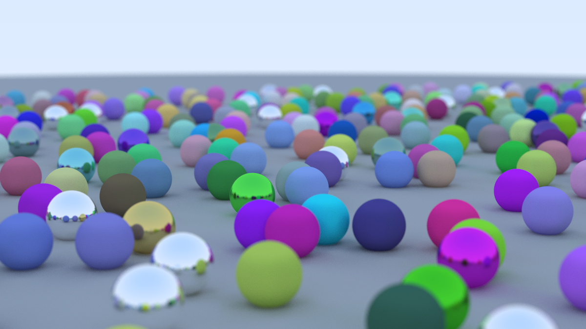

# Rust RayTracing

### Welcome to my RayTracing project – where spheres come to life with shadows, reflections, and refractions, each exhibiting its unique material properties.

**Key Features:**
- Render realistic spheres with dynamic shadows that dance with the play of light.
- Experience the mesmerizing world of reflections, where surfaces tell a tale of their surroundings.
- Delve into the optical illusions of refractions, revealing the inner character of spheres through different materials.

**Inspiration:**
Inspired by the principles outlined in the ["Ray Tracing in One Weekend"](https://raytracing.github.io/books/RayTracingInOneWeekend.html) book, this project takes the essence of ray tracing and manifests it into a Rust-powered spectacle.

Embark on a visual journey where each sphere is not just an object but a canvas for exploring the nuances of light, shadows, and materials.
